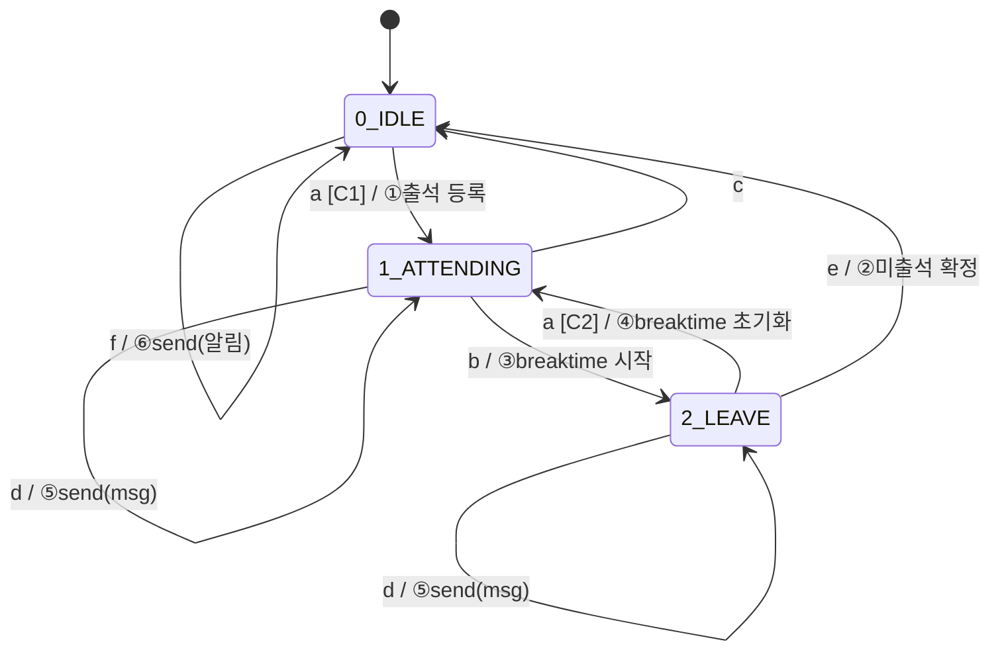

# FSM 설계 문서

## State

| 번호 | 상태 | 설명 |
|---|---|---|
| 0 | IDLE | 대기 중, 미입장 |
| 1 | ATTENDING | 강의실 내, 출석 인정 |
| 2 | LEAVE | 강의실 이탈, breaktime 카운트 중 |

---

## Event

| 기호 | 설명 |
|---|---|
| a | 위치 감지 (안) |
| b | 위치 감지 (밖) |
| c | 출석시간 종료 |
| d | 채팅 입력 |
| e | breaktime 초과 |
| f | 종료 5분 전 & 미입장 |

---

## Action

| 번호 | 설명 |
|---|---|
| ① | 출석 등록 |
| ② | 미출석 확정 |
| ③ | breaktime 시작 |
| ④ | breaktime 초기화 |
| ⑤ | send(msg) |
| ⑥ | send(알림) |

---

## Condition

| 기호 | 설명 |
|---|---|
| C1 | 출석시간 내 |
| C2 | breaktime 미초과 |

---

## 상태 전환 테이블

| 전환 | Event | Cond | Action |
|---|---|---|---|
| 0 → 1 | a | C1 | ① |
| 0 → 0 | c | - | ② |
| 0 → 0 | f | - | ⑥ |
| 1 → 2 | b | - | ③ |
| 1 → 1 | d | - | ⑤ |
| 1 → 0 | c | - | - |
| 2 → 1 | a | C2 | ④ |
| 2 → 2 | d | - | ⑤ |
| 2 → 0 | e | - | ② |

---

## FSM 다이어그램

