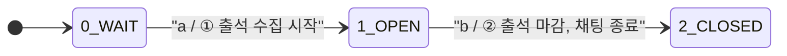
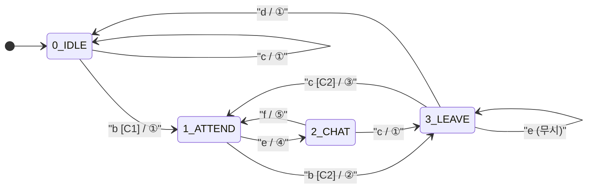

# 자동 출결 시스템 FSM 설계 문서

> **Team 3조** | 네트워크와 프로토콜 설계 캡스톤디자인  
> 주제: LoRa 기반 자동 출결 시스템

---

## 목차

1. [시스템 개요](#시스템-개요)
2. [패킷 타입 정의](#패킷-타입-정의)
3. [컨트롤 유닛 FSM](#1-컨트롤-유닛-fsm)
4. [학생 FSM](#2-학생-fsm)
5. [전체 동작 흐름](#전체-동작-흐름)

---

## 시스템 개요

LoRa 보드를 활용한 출결 자동 처리 시스템으로, 위치 신호 세기(RSSI)를 threshold와 비교하여 학생의 강의실 입/이탈을 판단하고 출석 상태를 자동으로 관리한다.

**주요 기능**

| # | 기능 |
|---|---|
| 1 | 출석 요구 시간 내에만 출석 등록 가능 |
| 2 | 입실 시 자동 출석 등록 |
| 3 | 출석자 간 오픈 채팅 |
| 4 | 출석 마감 5분 전 미출석자 알림 |
| 5 | 이탈 후 breaktime 초과 시 자동 결석 처리 |

---

## 패킷 타입 정의

| 타입 | 설명 | 처리 주체 |
|---|---|---|
| `LOCATION` | 학생 위치 신호 세기 정보 | 출석 상태 판단 (threshold 비교) |
| `CHAT` | 채팅 메시지 | 브로드캐스트 |

**패킷 라우팅 규칙**

```
packet.type == "LOCATION" → event a / b / c 처리
packet.type == "CHAT"     → event e / f 처리
```

---

## 1. 컨트롤 유닛 FSM

### State

| 번호 | 상태 | 설명 |
|---|---|---|
| 0 | `WAIT` | 수업 시작 전 대기 |
| 1 | `OPEN` | 출석 수집 중, LOCATION/CHAT 패킷 수신 활성화 |
| 2 | `CLOSED` | 출석 마감, 채팅 종료 |

### Event

| 기호 | 설명 |
|---|---|
| `a` | 수업 시작 시간 도달 |
| `b` | 출석 마감 시간 도달 |

### Action

| 번호 | 설명 |
|---|---|
| ① | 출석 수집 시작, LOCATION/CHAT 패킷 수신 활성화 |
| ② | 출석 마감, 채팅 종료 브로드캐스트 |

### 상태 전환 테이블

| 전환 | Event | Condition | Action |
|---|---|---|---|
| `0 → 1` | `a` | - | ① |
| `1 → 2` | `b` | - | ② |

### FSM 다이어그램



---

## 2. 학생 FSM

### State

| 번호 | 상태 | 설명 |
|---|---|---|
| 0 | `IDLE` | 강의실 미입장 |
| 1 | `ATTEND` | 강의실 입장, 출석 인정 |
| 2 | `CHAT` | 채팅 중 |
| 3 | `LEAVE` | 강의실 이탈 중, breaktime 카운트 |

### Event

| 기호 | 설명 |
|---|---|
| `a` | 신호 수신 |
| `b` | 수신신호 > threshold (밖으로 판단) |
| `c` | 수신신호 < threshold (안으로 판단) |
| `d` | timeout — breaktime 초과 |
| `e` | 채팅 요청 |
| `f` | 채팅 종료 |

### Action

| 번호 | 설명 |
|---|---|
| ① | 출석 상태 변경 (true / false) |
| ② | 이탈시간 기록, breaktime 타이머 시작 |
| ③ | breaktime 타이머 초기화, 입장시간 기록 |
| ④ | 채팅요청 송신 |
| ⑤ | 채팅종료 송신 |

### Condition

| 기호 | 설명 |
|---|---|
| `C1` | 출석 윈도우 내 (출석 인정 시간 범위) |
| `C2` | `breaktime_timer < breaktime_MAX` |

### 상태 전환 테이블

| 전환 | Event | Condition | Action | 설명 |
|---|---|---|---|---|
| `0 → 0` | `c` | - | ① | 강의실 밖에서 신호 수신 (무효) |
| `0 → 1` | `b` | C1 | ① | 출석 윈도우 내 입장 → 출석 인정 |
| `1 → 2` | `e` | - | ④ | 출석 후 채팅 입장 |
| `1 → 3` | `b` | C2 | ② | 입장 상태에서 이탈 감지 → breaktime 시작 |
| `2 → 1` | `f` | - | ⑤ | 채팅 종료 → 출석 상태 복귀 |
| `2 → 3` | `c` | - | ① | 채팅 중 이탈 감지 |
| `3 → 1` | `c` | C2 | ③ | breaktime 내 복귀 → 출석 유지 |
| `3 → 3` | `e` | - | - | 이탈 중 채팅 요청 → 무시 |
| `3 → 0` | `d` | - | ① | breaktime 초과 → 결석 처리 |

### FSM 다이어그램



---

## 전체 동작 흐름

```
[수업 시작 전]
  Control Unit: WAIT
  모든 학생: IDLE

[수업 시작 시간 도달] → event a
  Control Unit: WAIT → OPEN (① 출석 수집 시작)

[출석 윈도우 내 학생 입장] → event b, C1 만족
  학생: IDLE → ATTEND (① 출석 true)
  → 채팅 요청 시 ATTEND → CHAT

[학생 이탈] → event b (ATTEND/CHAT 상태)
  학생: → LEAVE (② breaktime 타이머 시작)
    ├─ breaktime 내 복귀 (event c, C2): LEAVE → ATTEND (③)
    └─ breaktime 초과 (event d): LEAVE → IDLE (① 출석 false)

[출석 마감 시간 도달] → event b (Control Unit)
  Control Unit: OPEN → CLOSED (② 채팅 종료 브로드캐스트)
```

---

## 설계 시 주요 고려 사항

| 항목 | 내용 |
|---|---|
| 출석 윈도우 | C1 조건으로 제어. 마감 후 입장은 IDLE 유지 |
| breaktime 정책 | C2 조건으로 제어. 초과 시 자동 결석 처리 |
| LEAVE 중 채팅 | `3 → 3` self-loop, 채팅 요청 무시 |
| 채팅 권한 | ATTEND → CHAT 전이 후에만 채팅 가능 |
| 마감 알림 | Control Unit에서 OPEN 상태 중 마감 5분 전 1회 브로드캐스트 |
