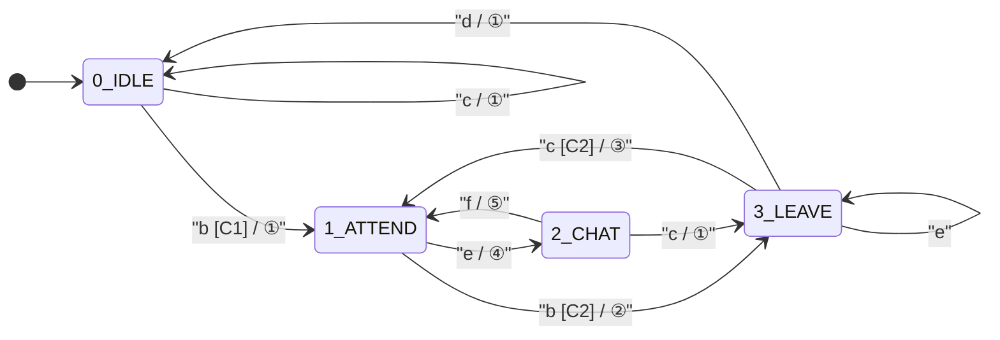

# FSM 설계 문서_V3

## 패킷 타입 정의

| 타입 | 설명 | 처리 주체 |
|---|---|---|
| `LOCATION` | 학생 위치 신호 세기 정보 | 출석 상태 판단 (threshold 비교) |
| `CHAT` | 채팅 메시지 | 브로드캐스트 |

```
packet.type == "LOCATION" → event a / b / c 처리
packet.type == "CHAT"     → event e / f 처리
```

---

## 1. 컨트롤 유닛 FSM

### State

| 번호 | 상태 | 설명 |
|---|---|---|
| 0 | WAIT | 수업 시작 전 대기 |
| 1 | OPEN | 출석 수집 중, LOCATION/CHAT 패킷 수신 활성화 |
| 2 | CLOSED | 출석 마감, 채팅 종료 |

### Event

| 기호 | 설명 |
|---|---|
| a | 수업 시작 시간 도달 |
| b | 출석 마감 시간 도달 |

### Action

| 번호 | 설명 |
|---|---|
| ① | 출석 수집 시작, LOCATION/CHAT 패킷 수신 활성화 |
| ② | 출석 마감, 채팅 종료 브로드캐스트 |

### 상태 전환 테이블

| 전환 | Event | Cond | Action |
|---|---|---|---|
| 0 → 1 | a | - | ① |
| 1 → 2 | b | - | ② |

### FSM 다이어그램


---

## 2. 학생 FSM

### State

| 번호 | 상태 | 설명 |
|---|---|---|
| 0 | IDLE | 강의실 미입장 |
| 1 | ATTEND | 강의실 입장, 출석 인정 |
| 2 | CHAT | 채팅 중 |
| 3 | LEAVE | 강의실 이탈 중, breaktime 카운트 |

### Event

| 기호 | 설명 |
|---|---|
| a | 신호 수신 |
| b | 수신신호 > threshold (밖) |
| c | 수신신호 < threshold (안) |
| d | timeout (breaktime 초과) |
| e | 채팅 요청 |
| f | 채팅 종료 |

### Action

| 번호 | 설명 |
|---|---|
| ① | 출석 상태 변경 (true / false) |
| ② | 이탈시간 기록, breaktime 타이머 시작 |
| ③ | breaktime 타이머 초기화, 입장시간 기록 |
| ④ | 채팅요청 송신 |
| ⑤ | 채팅종료 송신 |

### Condition

| 기호 | 설명 |
|---|---|
| C1 | 출석 윈도우 내 |
| C2 | breaktime_timer < breaktime_MAX |

### 상태 전환 테이블

| 전환 | Event | Cond | Action |
|---|---|---|---|
| 0 → 0 | c | - | ① |
| 0 → 1 | b | C1 | ① |
| 1 → 2 | e | - | ④ |
| 1 → 3 | b | C2 | ② |
| 2 → 1 | f | - | ⑤ |
| 2 → 3 | c | - | ① |
| 3 → 1 | c | C2 | ③ |
| 3 → 3 | e | - | - |
| 3 → 0 | d | - | ① |

### FSM 다이어그램


