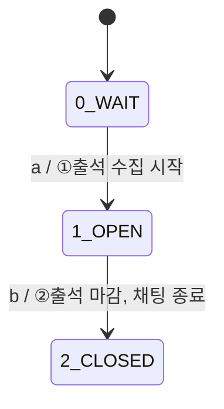
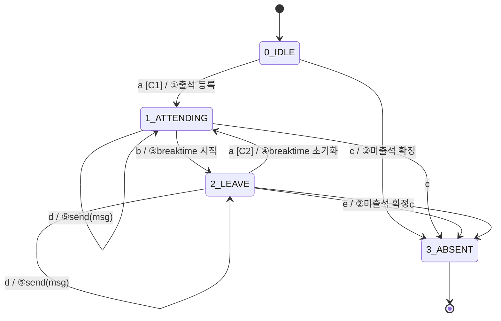

# FSM 설계 문서_V2

## Control Unit FSM

### State

| 번호 | 상태 | 설명 |
|---|---|---|
| 0 | WAIT | 수업 시작 전 대기 |
| 1 | OPEN | 출석 수집 중, LOCATION/CHAT 패킷 수신 활성화 |
| 2 | CLOSED | 출석 마감, 채팅 종료 |

### Event

| 기호 | 설명 |
|---|---|
| a | 수업 시작 시간 도달 |
| b | 출석 마감 시간 도달 |

### Action

| 번호 | 설명 |
|---|---|
| ① | 출석 수집 시작, LOCATION/CHAT 패킷 수신 활성화 |
| ② | 출석 마감, 채팅 종료 브로드캐스트 |

### 상태 전환 테이블

| 전환 | Event | Cond | Action |
|---|---|---|---|
| 0 → 1 | a | - | ① |
| 1 → 2 | b | - | ② |

### FSM 다이어그램



---

## 학생 FSM

### State

| 번호 | 상태 | 설명 |
|---|---|---|
| 0 | IDLE | 미입장, 채팅 불가 |
| 1 | ATTENDING | 강의실 내, 출석 인정, 채팅 가능 |
| 2 | LEAVE | 강의실 이탈, breaktime 카운트 중, 채팅 가능 |
| 3 | ABSENT | 미출석 확정, 채팅 불가 |

### Event

| 기호 | 설명 |
|---|---|
| a | LOCATION 패킷 수신 (안) |
| b | LOCATION 패킷 수신 (밖) |
| c | 수업 종료 |
| d | CHAT 패킷 수신 |
| e | breaktime 초과 |

### Action

| 번호 | 설명 |
|---|---|
| ① | 출석 등록 |
| ② | 미출석 확정 |
| ③ | breaktime 시작 |
| ④ | breaktime 초기화 |
| ⑤ | send(msg) |

### Condition

| 기호 | 설명 |
|---|---|
| C1 | 출석시간 내 |
| C2 | breaktime 미초과 |

### 상태 전환 테이블

| 전환 | Event | Cond | Action |
|---|---|---|---|
| 0 → 1 | a | C1 | ① |
| 0 → 3 | c | - | ② |
| 1 → 1 | d | - | ⑤ |
| 1 → 2 | b | - | ③ |
| 1 → 3 | c | - | - |
| 2 → 1 | a | C2 | ④ |
| 2 → 2 | d | - | ⑤ |
| 2 → 3 | e | - | ② |
| 2 → 3 | c | - | - |

### FSM 다이어그램



---

## 패킷 타입 정의

| 타입 | 설명 | 처리 주체 |
|---|---|---|
| `LOCATION` | 학생 위치 정보 | 출석 상태 판단 |
| `CHAT` | 채팅 메시지 | 브로드캐스트 |

```
packet.type == "LOCATION" → event a or b 처리
packet.type == "CHAT"     → event d 처리
```
